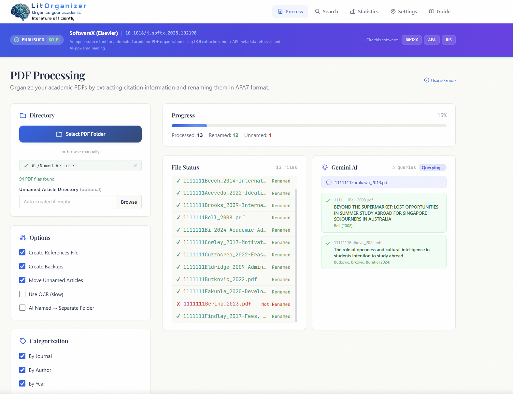
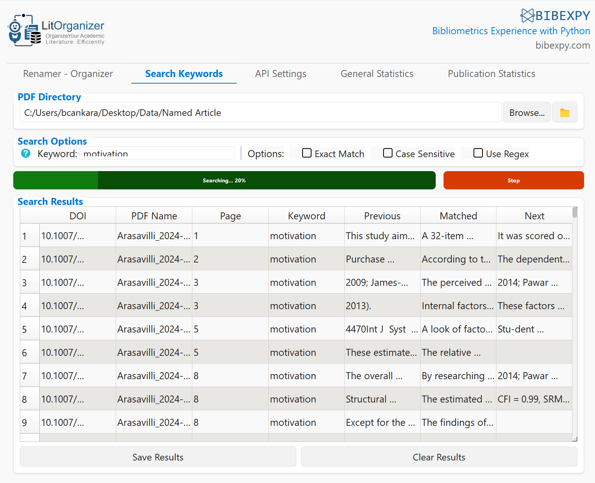
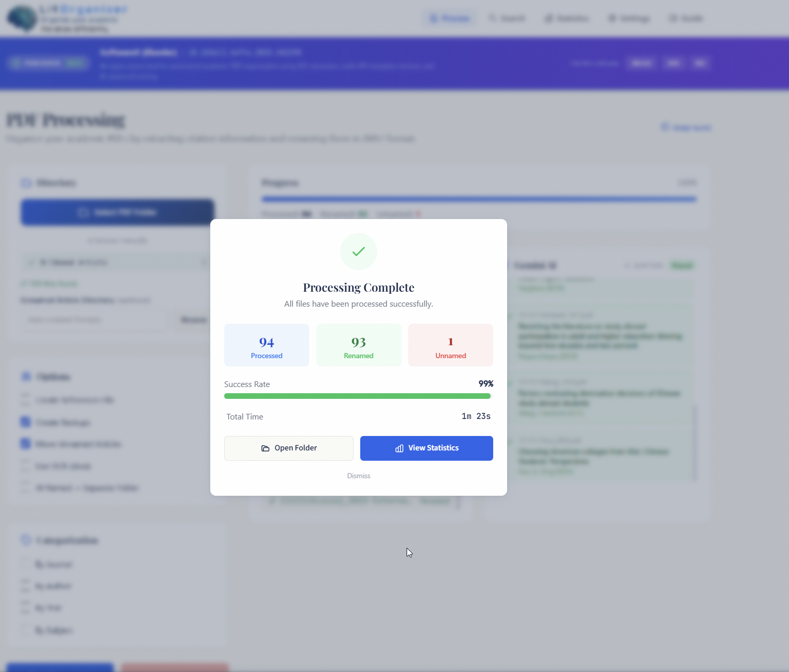
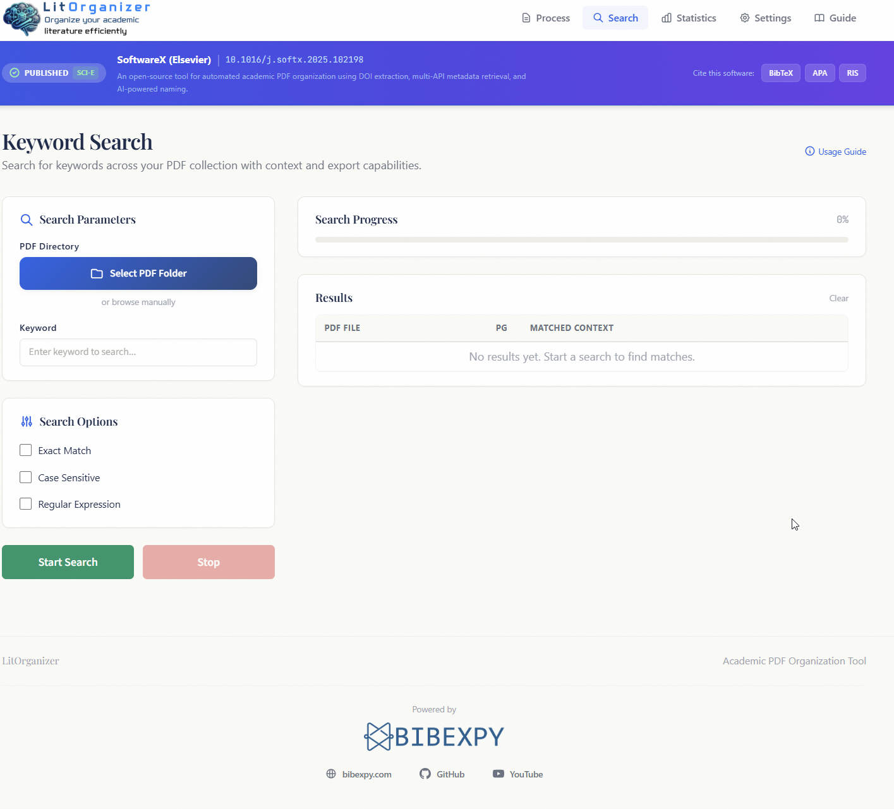
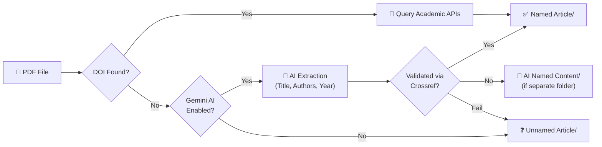

<div align="center">

  

  <br><br>

  **Automated Academic PDF Organization & Search — Powered by AI**

  <br>

  [](https://github.com/bcankara/LitOrganizer/releases)
  [](https://www.python.org)
  [](https://opensource.org/licenses/MIT)
  []()
  [](https://hub.docker.com/r/bcankara/litorganizer)

  <br>

  [](https://doi.org/10.1016/j.softx.2025.102198)
  [](https://www.sciencedirect.com/journal/softwarex)
  [](https://mjl.clarivate.com/)
  [](https://github.com/bcankara/LitOrganizer/stargazers)
  [](https://github.com/bcankara/LitOrganizer/issues)

  <br>

  <sub>Published in <a href="https://doi.org/10.1016/j.softx.2025.102198"><b>SoftwareX (Elsevier)</b></a> · Science Citation Index Expanded (SCI-E)</sub>

</div>

<br>

<p align="center">
  <a href="#-what-is-litorganizer">Overview</a> •
  <a href="#-screenshots">Screenshots</a> •
  <a href="#-key-features">Features</a> •
  <a href="#-how-it-works">Pipeline</a> •
  <a href="#-quick-start">Quick Start</a> •
  <a href="#-documentation">Docs</a> •
  <a href="#-citation">Citation</a>
</p>

---

## 📌 What is LitOrganizer?

> **LitOrganizer** is a free, open-source tool that **automatically organizes academic PDF collections**. It extracts metadata via DOI lookup, queries multiple academic APIs, and leverages **Google Gemini AI** as an intelligent fallback — then renames files using citation standards, categorizes them, and provides **full-text search** through a modern web interface.

<table>
<tr>
<td width="50%">

**The Problem:**
Researchers accumulate hundreds of PDFs with cryptic filenames like `1234567.pdf`, `paper_final_v3.pdf`, or `download(2).pdf`. Finding the right paper becomes a nightmare.

</td>
<td width="50%">

**The Solution:**
LitOrganizer automatically renames them to `(Smith, 2024) - Machine Learning in Healthcare.pdf` and organizes them into folders by journal, author, or year.

</td>
</tr>
</table>

---

## 📸 Screenshots

<div align="center">
  <table>
    <tr>
      <td align="center">
        
        <br><sub><b>PDF Processing</b> — Real-time progress with Gemini AI panel</sub>
      </td>
      <td align="center">
        
        <br><sub><b>Statistics Dashboard</b> — Performance & accuracy analytics</sub>
      </td>
    </tr>
    <tr>
      <td align="center">
        
        <br><sub><b>Processing Complete</b> — Summary with success rate</sub>
      </td>
      <td align="center">
        
        <br><sub><b>Full-Text Search</b> — Search across all PDFs with export</sub>
      </td>
    </tr>
  </table>
</div>

---

## ✨ Key Features

<table>
<tr>
<td width="50%" valign="top">

### 🔍 Smart Metadata Extraction
Automatically detects DOIs from PDF text and queries **7+ academic APIs** simultaneously for accurate metadata:

`Crossref` · `OpenAlex` · `DataCite` · `Europe PMC` · `Semantic Scholar` · `Scopus` · `Unpaywall`

</td>
<td width="50%" valign="top">

### 🤖 Google Gemini AI Fallback
When DOI extraction fails, **Gemini AI** reads the PDF content and extracts title, authors, and year — then validates via Crossref.

*Real-time AI status panel shows extraction progress.*

</td>
</tr>
<tr>
<td width="50%" valign="top">

### 📝 Citation-Based Renaming
Files are renamed using **APA 7th edition** format:

```
(Author, Year) - Title.pdf
```

Automatic folder categorization: **journal** · **author** · **year** · **subject**

</td>
<td width="50%" valign="top">

### 🔎 Full-Text Search
Search across your **entire PDF collection** with:
- Exact match & regex support
- Sentence-level context highlighting
- Export results to **Word** or **Excel**

</td>
</tr>
<tr>
<td width="50%" valign="top">

### 📊 Real-Time Web Interface
- **WebSocket-powered** live progress with animated rings
- Native OS folder picker dialog
- Statistics dashboard with performance metrics

</td>
<td width="50%" valign="top">

### 📋 Reference Generation
- Auto-generated bibliography of all processed papers
- Publication analytics by author, journal & year
- Detailed error diagnostics for problematic files

</td>
</tr>
</table>

---

## 🔬 How It Works

LitOrganizer uses a multi-stage pipeline to extract metadata and name your PDF files:


```mermaid
flowchart LR
    A["📄 PDF File"] --> B{"DOI Found?"}
    B -- Yes --> C["🔗 Query Academic APIs"]
    C --> D["✅ Named Article/"]
    B -- No --> E{"Gemini AI\nEnabled?"}
    E -- Yes --> F["🤖 AI Extraction\n(Title, Authors, Year)"]
    F --> G{"Validated via\nCrossref?"}
    G -- Yes --> D
    G -- No --> H["📁 AI Named Content/\n(if separate folder)"]
    E -- No --> I["❓ Unnamed Article/"]
    G -- Fail --> I
```

**Output directory structure:**
```
your_pdf_folder/
├── Named Article/          ← DOI + API verified or Gemini AI validated
├── AI Named Content/       ← Gemini AI named (optional separate folder)
├── Unnamed Article/        ← No metadata found
└── backups/                ← Original file backups (if enabled)
```

---

## 🚀 Quick Start

The launcher scripts handle everything automatically — Python check, virtual environment, dependencies, and server startup.

<details open>
<summary><b>🪟 Windows</b></summary>

1. **Download** or clone the repository
2. **Double-click** `start_litorganizer.bat`
3. Browser opens automatically at `http://localhost:5000`

</details>

<details>
<summary><b>🍎 macOS</b></summary>

```bash
git clone https://github.com/bcankara/LitOrganizer.git
cd LitOrganizer
chmod +x start_litorganizer.sh "Start LitOrganizer.command"
```

**Option A:** Double-click `Start LitOrganizer.command` in Finder
**Option B:** Run `./start_litorganizer.sh` in Terminal

> **Note:** If downloaded as ZIP, remove quarantine first: `xattr -cr .`

</details>

<details>
<summary><b>🐧 Linux</b></summary>

```bash
git clone https://github.com/bcankara/LitOrganizer.git
cd LitOrganizer
chmod +x start_litorganizer.sh
./start_litorganizer.sh
```

</details>

<details>
<summary><b>🛠 Manual Installation</b></summary>

```bash
# Clone & setup
git clone https://github.com/bcankara/LitOrganizer.git
cd LitOrganizer

# Create & activate virtual environment
python3 -m venv .venv
source .venv/bin/activate        # macOS / Linux
# .venv\Scripts\activate         # Windows

# Install & run
pip install -r requirements.txt
python litorganizer.py
```

</details>

<details>
<summary><b>🐳 Docker</b></summary>

```bash
# Quick start — mount your PDF folder and open http://localhost:5000
docker run -d -p 5000:5000 -v $(pwd)/pdfs:/app/pdf bcankara/litorganizer:v2
```

Or with Docker Compose:

```bash
# docker-compose.yml is included in the repo
docker compose up -d
```

Open your browser at **http://localhost:5000**

To persist your API key settings, also mount the config volume:

```bash
docker run -d -p 5000:5000 \
  -v $(pwd)/pdfs:/app/pdf \
  -v $(pwd)/config:/app/config \
  bcankara/litorganizer:v2
```

</details>

<details>
<summary><b>⌨️ Command Line Mode</b></summary>

```bash
python litorganizer.py -d /path/to/pdfs --create-references
```

Run `python litorganizer.py --help` for all available options.

</details>

---

## ⚙️ Configuration

API settings can be managed on the **Settings** page or by editing `config/api_keys.json`.

| API | Status | Requires |
|:----|:------:|:--------:|
| Crossref | ✅ Enabled | — |
| OpenAlex | ✅ Enabled | Email |
| DataCite | ✅ Enabled | — |
| Europe PMC | ✅ Enabled | — |
| Semantic Scholar | ✅ Enabled | — |
| Scopus | ⬚ Optional | API Key |
| Unpaywall | ⬚ Optional | Email |
| **Google Gemini AI** | **⬚ Optional** | **API Key** |

<details>
<summary><b>🤖 Enable Gemini AI</b></summary>

1. Open the **Settings** page in LitOrganizer
2. Toggle **Google Gemini Flash** on
3. Enter your free API key from [Google AI Studio](https://aistudio.google.com/apikey)
4. Save — Gemini AI will be used as fallback when DOI extraction fails

</details>

---

## 📖 Documentation

For detailed usage instructions, see the **[User Guide](documents/GUIDE.md)** which covers:

| Topic | Description |
|:------|:------------|
| 🔄 Naming Pipeline | How metadata is extracted and files are renamed |
| 🤖 Gemini AI Setup | Configuration and usage of the AI fallback |
| 🔎 Keyword Search | Regex examples and export options |
| 📁 Output Structure | How files are organized into folders |
| ⚙️ API Reference | Available APIs and configuration |

> 💡 **In-App Guide**: After launching, click **Guide** in the navigation menu for interactive documentation.

---

## 🛠️ Tech Stack

| Layer | Technologies |
|:------|:-------------|
| **Backend** | Python · Flask · Flask-SocketIO · PyMuPDF · pdfplumber |
| **AI** | Google Gemini Flash 2.0 API |
| **Frontend** | Tailwind CSS · Socket.IO Client · SVG Progress Rings · Native OS Dialog |
| **Data Export** | pandas · openpyxl · python-docx |

---

## 🗺️ Roadmap

- [x] Modern web interface with real-time updates
- [x] DOI fallback with Crossref title search
- [x] Google Gemini AI integration
- [x] Native OS folder picker
- [x] Built-in usage guide
- [x] Full-text search with Word/Excel export
- [ ] Batch export in BibTeX / RIS format
- [x] Docker support
- [ ] Dark mode

---

## 📄 Citation

If you use **LitOrganizer** in your research, please cite:

> Şahin, A., Kara, B. C., & Dirsehan, T. (2025). LitOrganizer: Automating the process of data extraction and organization for scientific literature reviews. *SoftwareX*, *30*, 102198. https://doi.org/10.1016/j.softx.2025.102198

<details>
<summary><b>BibTeX</b></summary>

```bibtex
@article{sahin2025litorganizer,
  title     = {LitOrganizer: Automating the process of data extraction and organization for scientific literature reviews},
  author    = {Şahin, Alperen and Kara, Burak Can and Dirsehan, Taşkın},
  journal   = {SoftwareX},
  volume    = {30},
  pages     = {102198},
  year      = {2025},
  publisher = {Elsevier},
  doi       = {10.1016/j.softx.2025.102198}
}
```

</details>

<details>
<summary><b>APA 7th Edition</b></summary>

```
Şahin, A., Kara, B. C., & Dirsehan, T. (2025). LitOrganizer: Automating the process of data
extraction and organization for scientific literature reviews. SoftwareX, 30, 102198.
https://doi.org/10.1016/j.softx.2025.102198
```

</details>

<details>
<summary><b>RIS</b></summary>

```
TY  - JOUR
TI  - LitOrganizer: Automating the process of data extraction and organization for scientific literature reviews
AU  - Şahin, Alperen
AU  - Kara, Burak Can
AU  - Dirsehan, Taşkın
JO  - SoftwareX
VL  - 30
SP  - 102198
PY  - 2025
SN  - 2352-7110
DO  - 10.1016/j.softx.2025.102198
UR  - https://www.sciencedirect.com/science/article/pii/S2352711025001657
ER  -
```

</details>

---

## 📋 Changelog

<details>
<summary><b>v2.0.0 — AI-Powered Web Application (Latest)</b></summary>

> **Major Release:** Complete redesign from PyQt5 desktop app to Flask + Socket.IO web application with Google Gemini AI integration.

#### ✅ Added
- Google Gemini AI integration with real-time status panel
- Modern web interface with Tailwind CSS
- WebSocket-powered live progress tracking with circular progress rings
- Native OS folder picker with quick access shortcuts
- Multi-stage DOI fallback pipeline
- Global activity panel & completion modal
- Comprehensive usage guide page
- Search export to Word/Excel with highlights

#### 🔧 Fixed
- Backup system file copy scope issue
- Cross-platform path separator in "Open Folder"
- Statistics persistence across page navigation
- Progress ring synchronization

#### 🔄 Changed
- Architecture: PyQt5 → Flask + Socket.IO
- Default AI-named files go to `Named Article/` (configurable)
- Native OS dialog replaces drag-and-drop zone
- Python requirement broadened to 3.10+

#### 🗑️ Removed
- PyQt5 desktop GUI & `modules/gui/` directory
- `--gui` CLI argument
- Drag & drop directory selection
- Heuristic regex-based content extraction

</details>

<details>
<summary><b>v1.x — Desktop Application (Legacy)</b></summary>

- PyQt5-based desktop GUI with tabbed interface
- Basic progress bar
- Local-only operation

</details>

---

## 🤝 Contributing

Contributions are welcome! Please feel free to submit a Pull Request.

```
1. Fork the repository
2. Create your feature branch    →  git checkout -b feature/AmazingFeature
3. Commit your changes           →  git commit -m 'Add AmazingFeature'
4. Push to the branch            →  git push origin feature/AmazingFeature
5. Open a Pull Request
```

---

## 📬 Contact & Support

<div align="center">

[](https://github.com/bcankara/LitOrganizer/issues)
[](https://github.com/bcankara/LitOrganizer/discussions)

</div>

---

<div align="center">
  <a href="https://github.com/bcankara/LitOrganizer/stargazers">
    
  </a>
  &nbsp;
  <a href="https://github.com/bcankara/LitOrganizer/fork">
    
  </a>
  <br><br>
  <sub>Made with ❤️ for the academic community</sub>
</div>
