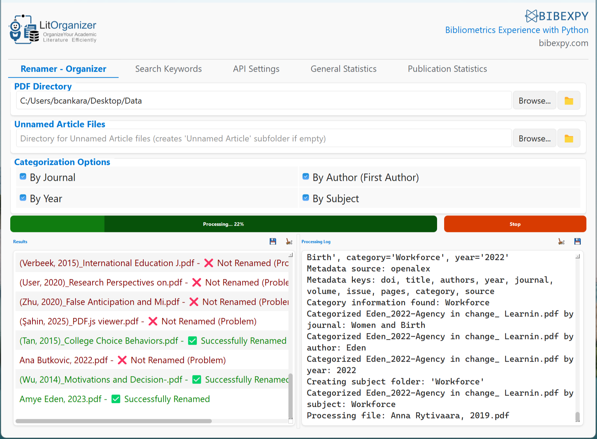
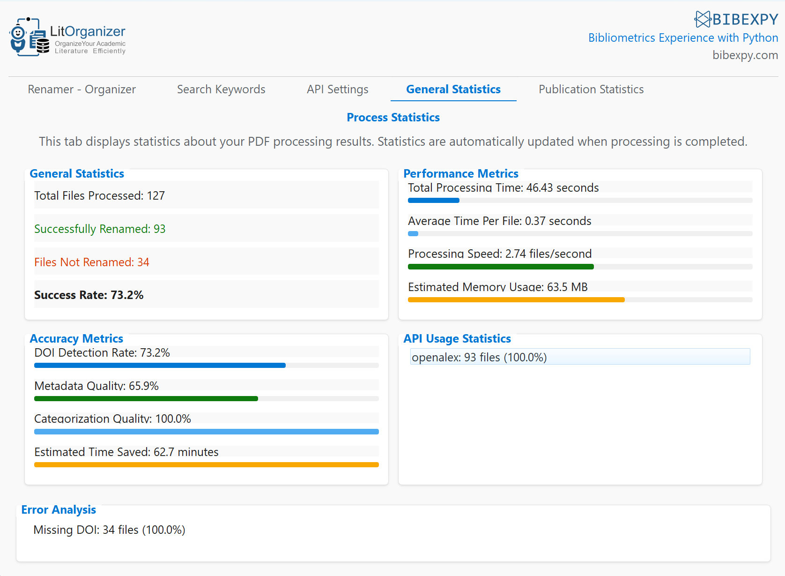

<div align="center">
  
  <br>
  <h3>Organize Your Academic Literature Efficiently</h3>
  
  [](https://www.python.org)
  [](https://pypi.org/project/PyQt5/)
  [](https://opensource.org/licenses/MIT)
  [](https://github.com/bcankara/LitOrganizer/stargazers)
  [](https://github.com/bcankara/LitOrganizer/issues)
  [](https://github.com/bcankara/LitOrganizer/releases)
  [](https://github.com/bcankara/LitOrganizer/releases)
</div>

LitOrganizer is a powerful tool designed for researchers, academics, and students to organize their PDF literature collections automatically. It extracts metadata from academic papers, renames files according to citation standards, categorizes them into a logical directory structure, and provides powerful search capabilities.

<div align="center" style="margin: 25px auto; max-width: 850px;">
  <table style="margin: 0 auto; border-collapse: separate; border-spacing: 15px;">
    <tr>
      <td align="center" style="padding: 10px; background-color: #f8f9fa; border-radius: 12px; box-shadow: 0 4px 6px rgba(0,0,0,0.1);">
        
        <p style="margin-top: 15px; font-weight: bold;">Main Organization Tab</p>
      </td>
      <td align="center" style="padding: 10px; background-color: #f8f9fa; border-radius: 12px; box-shadow: 0 4px 6px rgba(0,0,0,0.1);">
        
        <p style="margin-top: 15px; font-weight: bold;">Search Keywords Tab</p>
      </td>
    </tr>
    <tr>
      <td align="center" style="padding: 10px; background-color: #f8f9fa; border-radius: 12px; box-shadow: 0 4px 6px rgba(0,0,0,0.1);">
        
        <p style="margin-top: 15px; font-weight: bold;">General Statistics Tab</p>
      </td>
      <td align="center" style="padding: 10px; background-color: #f8f9fa; border-radius: 12px; box-shadow: 0 4px 6px rgba(0,0,0,0.1);">
        
        <p style="margin-top: 15px; font-weight: bold;">Publication Statistics Tab</p>
      </td>
    </tr>
  </table>
</div>

## ✨ Features

### 📚 Automatic Organization
- **Smart Metadata Extraction**: Automatically extracts DOIs and retrieves complete metadata from multiple academic APIs
- **Citation-based Renaming**: Renames PDF files using APA7 format (Author_Year) for easy identification
- **Intelligent Categorization**: Organizes PDFs into folders by journal, author, year, or subject
- **Reference List Generation**: Creates a comprehensive bibliography of all processed papers

### 🔍 Advanced Search Capabilities
- **Full-text Search**: Quickly find information across your entire PDF collection
- **Context Display**: View search results with surrounding text for better understanding
- **Flexible Search Options**: Use exact match, case sensitivity, or regular expressions
- **Export Results**: Save search results to Word and Excel files with highlighted matches

### 📊 Comprehensive Statistics
- **Performance Metrics**: Visual representation of processing speed and efficiency
- **Accuracy Analysis**: Detailed breakdown of metadata quality and DOI detection rates
- **Publication Analytics**: Distribution of papers by author, journal, year, and subject
- **Error Diagnostics**: Identification of problematic files with detailed error analysis

### 💻 User-Friendly Interface
- **Modern Design**: Clean, intuitive interface with Windows 11 design principles
- **Multi-tab Layout**: Separate tabs for organization, search, and statistics
- **Progress Tracking**: Real-time progress indicators and detailed logging
- **Customizable Options**: Flexible settings to adapt to your workflow

## 🚀 Installation

### Requirements
- Python 3.8 or later
- Required Python packages (see `requirements.txt`)
- For OCR functionality: [Tesseract OCR](https://github.com/tesseract-ocr/tesseract)

### Installation Steps

1. Clone or download this repository:
   ```bash
   git clone https://github.com/bcankara/LitOrganizer.git
   cd LitOrganizer
   ```

2. Install required dependencies:
   ```bash
   pip install -r requirements.txt
   ```

3. (Optional) For OCR functionality, install Tesseract OCR:
   - **Windows**: Download and install from [Tesseract at UB Mannheim](https://github.com/UB-Mannheim/tesseract/wiki)
   - **macOS**: `brew install tesseract`
   - **Linux**: `sudo apt install tesseract-ocr`

## 📖 Usage

### GUI Mode

Run the application without arguments to start in GUI mode:
```bash
python litorganizer.py
```

#### Main Tab

1. Select a directory containing PDFs using the "Browse" button
2. Configure categorization options (by journal, author, year, subject)
3. Click "Start Processing" to begin organizing your files
4. Monitor progress in the log window

#### Search Keywords Tab

1. Select a directory containing PDFs
2. Enter a keyword to search for
3. Configure search options:
   - **Exact Match**: Only match complete words
   - **Case Sensitive**: Match exact letter case
   - **Use Regex**: Use regular expressions for pattern matching
4. Click "Start Search" to begin
5. View results and save to Word/Excel if desired

#### Statistics Tabs

1. **General Statistics**: Overall performance metrics and accuracy analysis
2. **Publication Statistics**: Detailed breakdown by author, journal, year, and subject

### Command Line Mode

Basic usage:
```bash
python litorganizer.py -d /path/to/pdfs
```

Additional options:
```bash
python litorganizer.py --help
```

## ⚙️ Configuration

API settings for DOI metadata retrieval can be configured in the API Settings tab or by editing `config/api_config.json`.

## 🔄 Workflow Example

<div align="center">
  <p><strong>LitOrganizer Workflow</strong></p>
  <ol>
    <li>Start with unorganized PDFs</li>
    <li>Extract DOIs and metadata</li>
    <li>Rename and categorize files</li>
    <li>Generate references and statistics</li>
  </ol>
</div>

1. **Input**: Start with a folder of unorganized PDF files
2. **Processing**: LitOrganizer extracts DOIs and retrieves metadata
3. **Organization**: Files are renamed and categorized
4. **Output**: A well-structured directory with properly named files

## 🛠️ Technical Details

LitOrganizer is built with:
- **PyQt5**: For the graphical user interface
- **PyMuPDF & pdfplumber**: For PDF text extraction
- **Requests**: For API communication with academic databases
- **pandas & python-docx**: For exporting search results

<div align="center">
  <table>
    <tr>
      <td align="center"><br>Python</td>
      <td align="center"><br>PyQt5</td>
      <td align="center"><br>PDF Processing</td>
      <td align="center"><br>Pandas</td>
      <td align="center"><br>VS Code</td>
    </tr>
  </table>
</div>

## 📝 License

This project is licensed under the MIT License - see the [LICENSE](LICENSE) file for details.

## 🙏 Acknowledgments

- Built with PyQt5 for the user interface
- Uses pdfplumber and PyMuPDF for PDF text extraction
- Integrated with multiple academic APIs for metadata retrieval

## 📬 Contact

For questions, suggestions, or issues, please [open an issue on GitHub](https://github.com/bcankara/LitOrganizer/issues) or contact the maintainer.

---

<div align="center">
  <a href="https://github.com/bcankara/LitOrganizer/stargazers">
    
  </a>
  <a href="https://github.com/bcankara/LitOrganizer/fork">
    
  </a>
  <a href="https://github.com/bcankara/LitOrganizer/watchers">
    
  </a>
  <br>
  <p>Made with ❤️ for the academic community</p>
</div> 