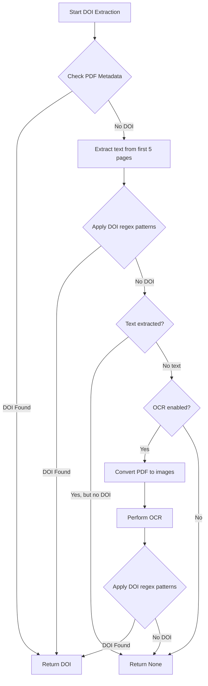
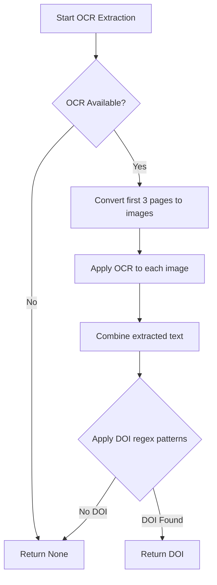
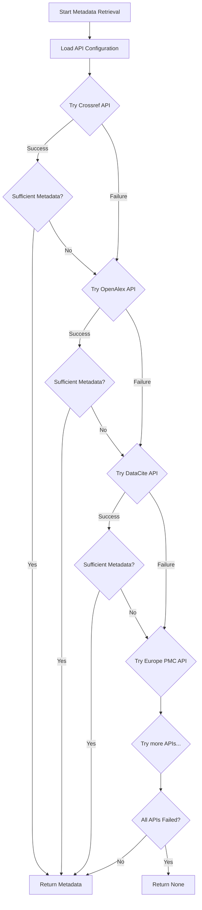
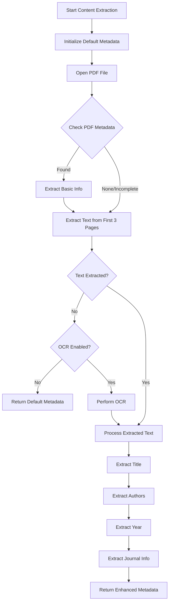
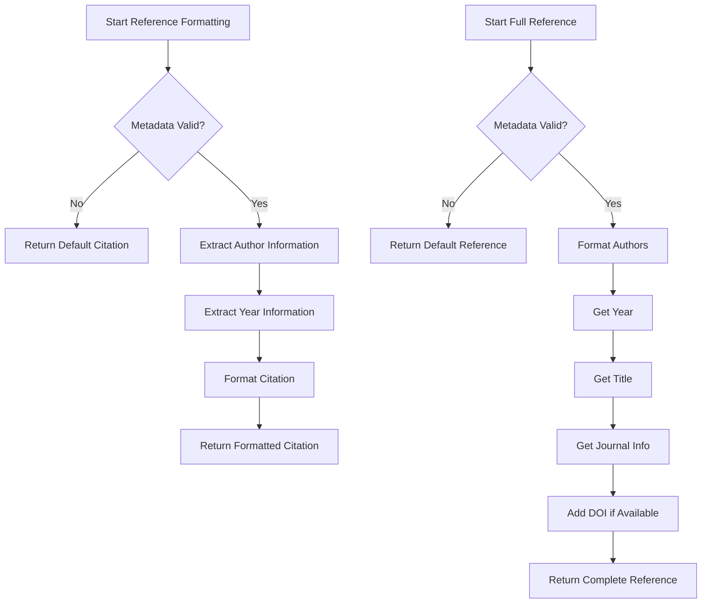
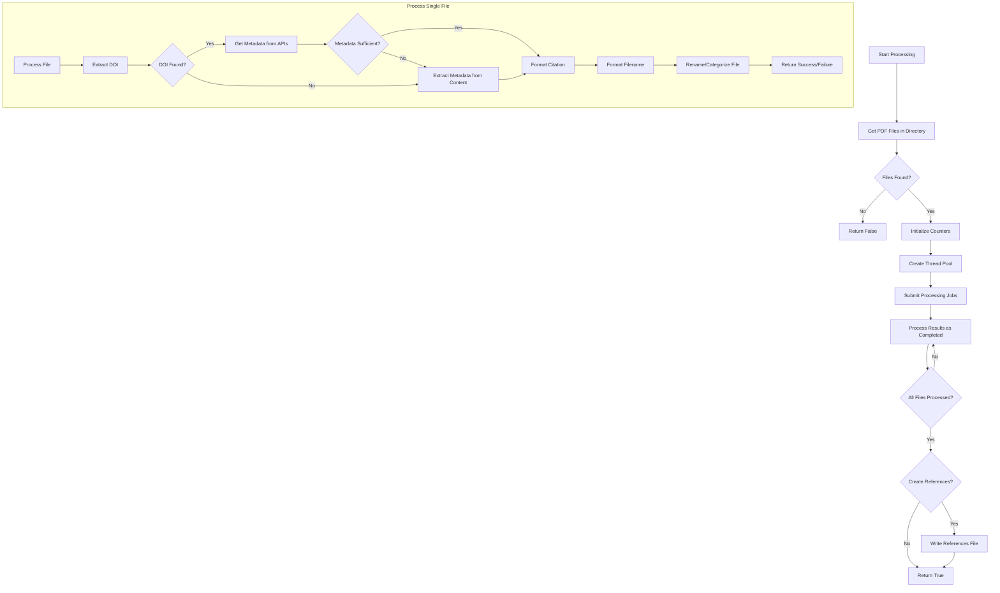
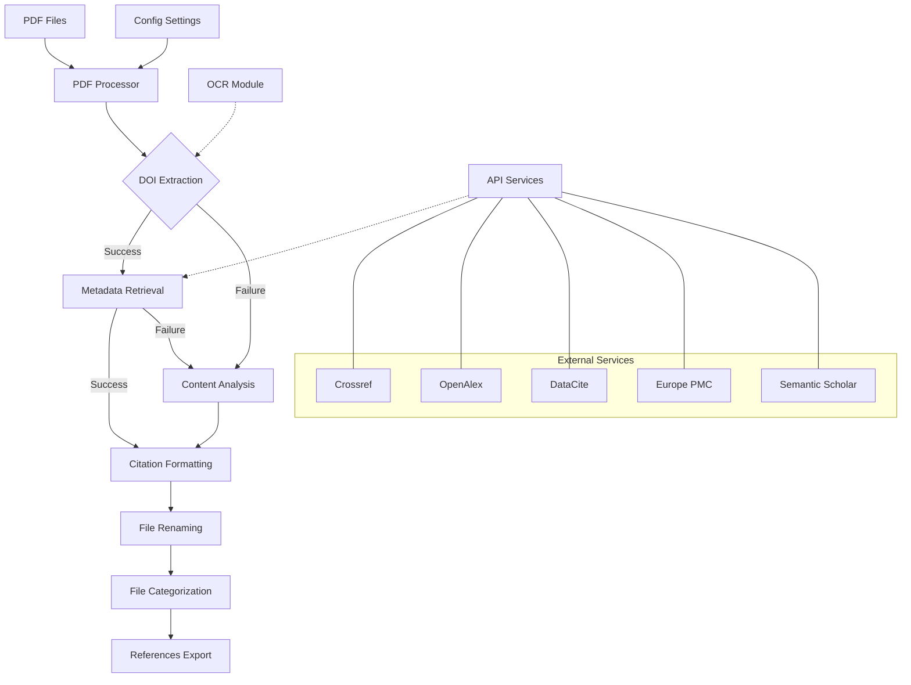

# Key Algorithms in LitOrganizer

This document details the core algorithms and methods used in LitOrganizer for academic paper management, particularly focusing on DOI extraction and keyword matching.

## DOI Extraction Algorithm

The DOI (Digital Object Identifier) extraction is one of the most fundamental operations in LitOrganizer. It allows the system to identify and retrieve metadata for academic papers.

### Process Flow Diagram



```python
def extract_doi(pdf_path: Union[str, Path], use_ocr: bool = False) -> Optional[str]:
    """
    Extract DOI from a PDF file.
    
    Args:
        pdf_path (Union[str, Path]): Path to the PDF file
        use_ocr (bool): Whether to use OCR for scanned PDFs
        
    Returns:
        Optional[str]: Extracted DOI or None if not found
    """
    logger = logging.getLogger('litorganizer.parsers')
    pdf_path = Path(pdf_path)
    
    # DOI regex patterns - Always starts with 10. prefix
    doi_patterns = [
        r'doi\.org/+(10\.[0-9]{4,}(?:\.[0-9]+)*\/[a-zA-Z0-9\._\(\)\-\+\/]+)',
        r'DOI:\s*(10\.[0-9]{4,}(?:\.[0-9]+)*\/[a-zA-Z0-9\._\(\)\-\+\/]+)',
        r'doi:\s*(10\.[0-9]{4,}(?:\.[0-9]+)*\/[a-zA-Z0-9\._\(\)\-\+\/]+)',
        r'(?:^|[^a-zA-Z0-9])(10\.[0-9]{4,}(?:\.[0-9]+)*\/[a-zA-Z0-9\._\(\)\-\+\/]+)',
        r'https?://(?:dx\.)?doi\.org/+(10\.[0-9]{4,}(?:\.[0-9]+)*\/[a-zA-Z0-9\._\(\)\-\+\/]+)'
    ]
    
    try:
        # Try to extract DOI using pdfplumber
        with pdfplumber.open(pdf_path) as pdf:
            # Check metadata first
            if pdf.metadata and 'doi' in pdf.metadata and pdf.metadata['doi']:
                logger.debug(f"DOI found in metadata: {pdf.metadata['doi']}")
                return pdf.metadata['doi']
            
            # Extract text from first few pages
            text = ""
            for i in range(min(5, len(pdf.pages))):
                page_text = pdf.pages[i].extract_text()
                if page_text:
                    text += page_text + "\n"
            
            # Search for DOI in text
            for pattern in doi_patterns:
                matches = re.search(pattern, text, re.IGNORECASE)
                if matches:
                    doi = matches.group(0).strip()
                    logger.debug(f"DOI found in text: {doi}")
                    return doi
            
            # If no DOI found and OCR is enabled, try OCR
            if not text.strip() and use_ocr and OCR_AVAILABLE:
                logger.debug("No text extracted, trying OCR...")
                return extract_doi_with_ocr(pdf_path, doi_patterns)
        
        logger.debug("No DOI found in PDF")
        return None
    
    except Exception as e:
        logger.error(f"Error extracting DOI: {e}")
        return None
```

### Algorithm Explanation

The DOI extraction algorithm follows a multi-stage approach:

1. **PDF Metadata Check**: First, it checks if the DOI is available in the PDF's metadata.
2. **Text Extraction**: Extracts text from the first 5 pages of the PDF.
3. **Pattern Matching**: Uses multiple regular expression patterns to find DOIs in the extracted text.
4. **OCR Fallback**: If no text is extracted or no DOI is found, it optionally uses Optical Character Recognition (OCR) to extract text from the PDF images.

The regular expressions are designed to match various DOI formats, including:
- DOIs prefixed with "doi.org/"
- DOIs prefixed with "DOI:" or "doi:"
- Standalone DOIs beginning with "10."
- DOIs in URLs like "https://doi.org/"

## OCR-Based DOI Extraction

For scanned papers, LitOrganizer uses OCR to extract text and then find DOIs:

### OCR Process Flow Diagram



```python
def extract_doi_with_ocr(pdf_path: Union[str, Path], doi_patterns: List[str]) -> Optional[str]:
    """
    Extract DOI from a PDF file using OCR.
    
    Args:
        pdf_path (Union[str, Path]): Path to the PDF file
        doi_patterns (List[str]): List of regex patterns for DOI extraction
        
    Returns:
        Optional[str]: Extracted DOI or None if not found
    """
    logger = logging.getLogger('pdf_citation_tool.parsers')
    
    if not OCR_AVAILABLE:
        logger.warning("OCR dependencies not available. Please install pytesseract and pdf2image.")
        return None
    
    try:
        # Convert first page of PDF to image
        logger.debug("Converting PDF to image for OCR...")
        images = convert_from_path(pdf_path, first_page=1, last_page=3)
        
        # Perform OCR on each image
        text = ""
        for img in images:
            text += pytesseract.image_to_string(img) + "\n"
        
        # Search for DOI in OCR text
        for pattern in doi_patterns:
            matches = re.search(pattern, text, re.IGNORECASE)
            if matches:
                doi = matches.group(0).strip()
                logger.debug(f"DOI found with OCR: {doi}")
                return doi
        
        logger.debug("No DOI found with OCR")
        return None
    
    except Exception as e:
        logger.error(f"Error performing OCR: {e}")
        return None
```

The OCR-based extraction:
1. Converts the first 3 pages of the PDF to images
2. Uses pytesseract (a Python wrapper for Tesseract OCR) to extract text from these images
3. Applies the same DOI pattern matching to the OCR-extracted text

## Metadata Retrieval from Online Sources

Once a DOI is extracted, LitOrganizer uses it to fetch detailed metadata from multiple online sources:

### Metadata Retrieval Flow Diagram



```python
def get_metadata_from_multiple_sources(doi: str) -> Optional[Dict[str, Any]]:
    """
    Attempt to retrieve metadata from multiple sources based on DOI.
    
    Args:
        doi (str): Digital Object Identifier
        
    Returns:
        Optional[Dict[str, Any]]: Metadata dictionary or None if retrieval fails
    """
    # Load API configuration to determine which services to use
    config = load_api_config()
    
    # Try Crossref first (primary source)
    if config.get("crossref", {}).get("enabled", True):
        metadata = get_metadata_from_crossref(doi)
        if metadata and has_sufficient_metadata(metadata):
            return metadata
    
    # Try OpenAlex
    if config.get("openalex", {}).get("enabled", True):
        metadata = get_metadata_from_openalex(doi)
        if metadata and has_sufficient_metadata(metadata):
            return metadata
    
    # Try DataCite
    if config.get("datacite", {}).get("enabled", True):
        metadata = get_metadata_from_datacite(doi)
        if metadata and has_sufficient_metadata(metadata):
            return metadata
    
    # Try Europe PMC
    if config.get("europepmc", {}).get("enabled", True):
        metadata = get_metadata_from_europepmc(doi)
        if metadata and has_sufficient_metadata(metadata):
            return metadata
    
    # Try Scopus if API key is available
    if config.get("scopus", {}).get("enabled", False):
        metadata = get_metadata_from_scopus(doi)
        if metadata and has_sufficient_metadata(metadata):
            return metadata
    
    # Try Semantic Scholar
    if config.get("semantic_scholar", {}).get("enabled", True):
        metadata = get_metadata_from_semantic_scholar(doi)
        if metadata and has_sufficient_metadata(metadata):
            return metadata
    
    # Try Unpaywall if email is provided
    if config.get("unpaywall", {}).get("enabled", False):
        metadata = get_metadata_from_unpaywall(doi)
        if metadata and has_sufficient_metadata(metadata):
            return metadata
    
    # If all sources fail, return None
    return None
```

### Metadata Retrieval Strategy

LitOrganizer uses a fallback strategy for metadata retrieval:

1. **Multiple APIs**: Tries several academic APIs (Crossref, OpenAlex, DataCite, Europe PMC, etc.)
2. **API Configuration**: Uses a configuration file to determine which APIs to use and in what order
3. **Sufficient Metadata Check**: Validates that retrieved metadata contains enough information (title, authors, year)
4. **Fail-safe Approach**: If one API fails, it tries the next one until it gets sufficient metadata

## Content-Based Metadata Extraction

When DOI-based metadata retrieval fails, LitOrganizer can extract basic metadata directly from the PDF content:

### Content-based Extraction Flow Diagram



```python
def extract_metadata_from_content(pdf_path: Union[str, Path], use_ocr: bool = False) -> Dict[str, Any]:
    """
    Extract metadata directly from PDF content when DOI-based methods fail.
    
    Args:
        pdf_path (Union[str, Path]): Path to the PDF file
        use_ocr (bool): Whether to use OCR for text extraction
        
    Returns:
        Dict[str, Any]: Dictionary of metadata extracted from content
    """
    logger = logging.getLogger('litorganizer.parsers')
    pdf_path = Path(pdf_path)
    metadata = {
        "title": "Unknown Title",
        "authors": ["Unknown Author"],
        "year": "",
        "journal": "",
        "source": "content_extraction"
    }
    
    try:
        # Extract text from PDF
        text = ""
        with pdfplumber.open(pdf_path) as pdf:
            # First try to get metadata from PDF metadata
            if pdf.metadata:
                if 'Title' in pdf.metadata and pdf.metadata['Title']:
                    metadata['title'] = pdf.metadata['Title']
                if 'Author' in pdf.metadata and pdf.metadata['Author']:
                    metadata['authors'] = [pdf.metadata['Author']]
                if 'CreationDate' in pdf.metadata and pdf.metadata['CreationDate']:
                    # Try to extract year from creation date
                    year_match = re.search(r'(\d{4})', pdf.metadata['CreationDate'])
                    if year_match:
                        metadata['year'] = year_match.group(1)
            
            # Extract text from first few pages for detailed analysis
            for i in range(min(3, len(pdf.pages))):
                page_text = pdf.pages[i].extract_text()
                if page_text:
                    text += page_text + "\n"
        
        # If no text extracted and OCR is enabled, try OCR
        if not text.strip() and use_ocr and OCR_AVAILABLE:
            logger.debug("No text extracted from PDF, trying OCR...")
            text = extract_text_with_ocr(pdf_path)
        
        if text.strip():
            # Extract title from text
            extracted_title = extract_title_from_text(text)
            if extracted_title:
                metadata['title'] = extracted_title
            
            # Extract authors from text
            extracted_authors = extract_authors_from_text(text)
            if extracted_authors:
                metadata['authors'] = extracted_authors
            
            # Extract year from text
            extracted_year = extract_year_from_text(text)
            if extracted_year:
                metadata['year'] = extracted_year
            
            # Extract journal information
            journal_info = extract_journal_info_from_text(text)
            if journal_info.get('journal'):
                metadata['journal'] = journal_info.get('journal')
            if journal_info.get('volume'):
                metadata['volume'] = journal_info.get('volume')
            if journal_info.get('issue'):
                metadata['issue'] = journal_info.get('issue')
            if journal_info.get('pages'):
                metadata['pages'] = journal_info.get('pages')
        
        return metadata
    
    except Exception as e:
        logger.error(f"Error extracting metadata from content: {e}")
        return metadata
```

### Content-Based Extraction Methods

LitOrganizer uses several pattern-matching techniques to extract metadata from PDF text:

#### Title Extraction

```python
def extract_title_from_text(text: str) -> str:
    """
    Extract the title from PDF text.
    
    Args:
        text (str): Text extracted from PDF
        
    Returns:
        str: Extracted title or empty string if not found
    """
    # Common patterns for titles
    title_patterns = [
        r'^(.*?)\n(?:Abstract|Introduction|ABSTRACT|INTRODUCTION)',  # Title before Abstract/Introduction
        r'(?:TITLE|Title):\s*([^\n]+)',  # Explicit Title: label
        r'(?:^|\n)([A-Z][^.!?]*?(?:[.!?]|$))',  # First sentence in all caps or first letter capitalized
    ]
    
    for pattern in title_patterns:
        matches = re.search(pattern, text, re.MULTILINE)
        if matches:
            title = matches.group(1).strip()
            # Clean up the title
            title = re.sub(r'\s+', ' ', title)
            # If title seems too long (> 200 chars), it's likely not a title
            if len(title) < 200:
                return title
    
    return ""
```

#### Author Extraction

```python
def extract_authors_from_text(text: str) -> List[str]:
    """
    Extract author names from PDF text.
    
    Args:
        text (str): Text extracted from PDF
        
    Returns:
        List[str]: List of extracted author names
    """
    # Common patterns for authors
    author_patterns = [
        r'(?:Author|AUTHORS|AUTHOR)s?:?\s*([^\n]+)',  # Explicit Authors: label
        r'(?:^|\n)([A-Z][^,]*(?:,[^,]+)+)',  # Names in format "Last, First"
        r'(?:^|\n)([^,\n]+(?:,[^,\n]+)+)',  # Any comma-separated names
    ]
    
    for pattern in author_patterns:
        matches = re.search(pattern, text, re.MULTILINE)
        if matches:
            authors_text = matches.group(1).strip()
            # Split by common separators
            authors = re.split(r'\s*[,;]\s*|\s+and\s+|\s*&\s*', authors_text)
            # Clean up and filter
            authors = [a.strip() for a in authors if a.strip()]
            if authors:
                return authors
    
    return ["Unknown Author"]
```

## Reference Formatting Algorithm

LitOrganizer generates APA7-style citations and references:

### Reference Formatting Flow Diagram



```python
def create_apa7_citation(metadata: Dict) -> str:
    """
    Create an APA7 in-text citation from metadata.
    
    Args:
        metadata (Dict): Metadata dictionary containing author and year information
        
    Returns:
        str: APA7 formatted citation (e.g., "(Smith, 2020)")
    """
    # Handle missing or invalid metadata
    if not metadata or not isinstance(metadata, dict):
        return "(Unknown, n.d.)"
    
    # Get author information
    authors = metadata.get("authors", [])
    if not authors or not isinstance(authors, list) or authors[0] == "Unknown Author":
        author_text = "Unknown"
    else:
        # Use the first author's last name
        author_text = extract_last_name(authors[0])
    
    # Get year information
    year = metadata.get("year", "")
    if not year or year == "0000":
        year = "n.d."  # n.d. = no date
    
    # Create citation in APA7 format
    citation = f"({author_text}, {year})"
    return citation
```

```python
def create_apa7_reference(metadata: Dict) -> str:
    """
    Create a complete APA7 reference from metadata.
    
    Args:
        metadata (Dict): Metadata dictionary containing author, year, title, etc.
        
    Returns:
        str: APA7 formatted reference
    """
    # Handle missing or invalid metadata
    if not metadata or not isinstance(metadata, dict):
        return "Unknown. (n.d.). Unknown title."
    
    # Get author information
    authors = metadata.get("authors", [])
    author_text = format_authors_for_reference(authors)
    
    # Get year information
    year = metadata.get("year", "")
    if not year or year == "0000":
        year = "n.d."  # n.d. = no date
    
    # Get title
    title = metadata.get("title", "Unknown title")
    
    # Get journal/publication
    journal = metadata.get("journal", "")
    volume = metadata.get("volume", "")
    issue = metadata.get("issue", "")
    pages = metadata.get("pages", "")
    doi = metadata.get("doi", "")
    
    # Create reference in APA7 format
    reference = f"{author_text} ({year}). {title}."
    
    # Add journal information if available
    if journal:
        reference += f" {journal}"
        if volume:
            reference += f", {volume}"
            if issue:
                reference += f"({issue})"
        if pages:
            reference += f", {pages}"
    
    # Add DOI if available
    if doi:
        reference += f". https://doi.org/{doi}"
    
    return reference
```

## File Management and Processing

The core processing logic in LitOrganizer handles PDFs through a parallel processing approach:

### Overall Processing Flow Diagram



```python
def process_files(self) -> bool:
    """
    Process all PDF files in the directory.
    
    Returns:
        bool: True if processing was successful, False otherwise
    """
    self.logger.info(f"Starting PDF processing in directory: {self.directory}")
    
    # Get all PDF files
    pdf_files = list(self.directory.glob("*.pdf"))
    
    if not pdf_files:
        self.logger.warning(f"No PDF files found in {self.directory}")
        return False
    
    self.logger.info(f"Found {len(pdf_files)} PDF files to process")
    
    # Reset counters
    self.processed_count = 0
    self.renamed_count = 0
    self.problematic_count = 0
    self.references = []
    
    # Use thread pool to process files in parallel
    with ThreadPoolExecutor(max_workers=self.max_workers) as executor:
        # Submit jobs
        futures = [executor.submit(self.process_file, pdf_file) for pdf_file in pdf_files]
        
        # Process results as they complete
        for future in as_completed(futures):
            try:
                result = future.result()
                self.processed_count += 1
                if result:
                    self.renamed_count += 1
                else:
                    self.problematic_count += 1
                    self.logger.debug(f"File counted as problematic (could not be renamed)")
            except Exception as e:
                self.logger.error(f"Error in worker thread: {str(e)}")
                self.problematic_count += 1
                self.processed_count += 1  # Count as processed even in case of error
    
    # Write references file if requested
    if self.create_references and self.references:
        self.write_references_file()
    
    return True
```

## Conclusion

LitOrganizer employs a sophisticated multi-stage approach to extract DOIs and metadata from academic PDFs:

1. **DOI Extraction**: Uses regex pattern matching on PDF text, with OCR as a fallback
2. **Metadata Retrieval**: Queries multiple academic APIs with the extracted DOI
3. **Content-Based Extraction**: Falls back to extracting metadata directly from PDF content when DOI methods fail
4. **Reference Formatting**: Generates standardized APA7 citations and references
5. **Parallel Processing**: Uses thread pools to process multiple PDF files simultaneously

These algorithms work together to provide a robust solution for organizing academic literature, even with challenging or scanned PDFs. 

### System Architecture Overview

